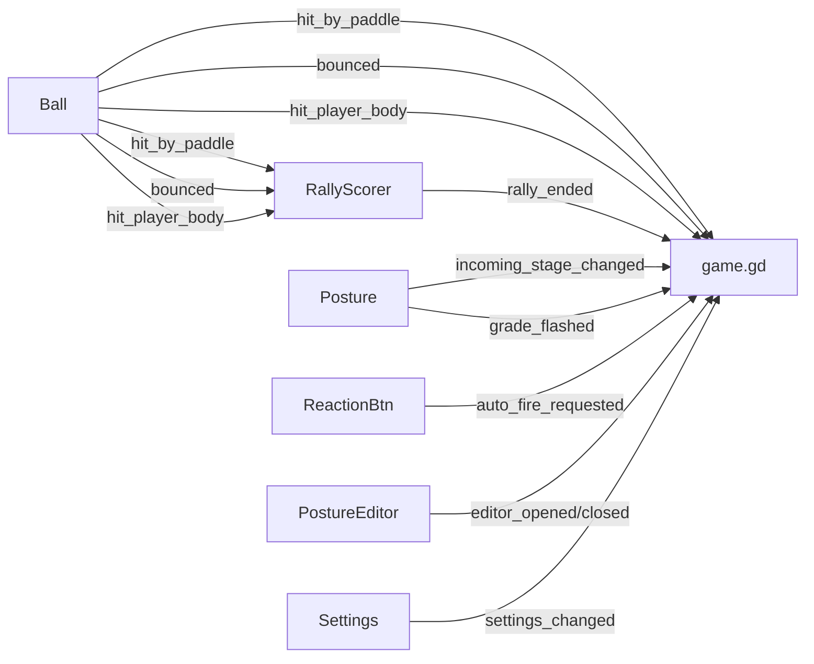

# Code Harmony & Elegance — Full Codebase Review

## Background

The pickleball Godot project has grown organically from a prototype into a sophisticated simulation with 30+ GDScript files, 9 player modules, a full posture editor, ball audio synthesis, and comprehensive rule enforcement. This review covers **every architectural aspect** and proposes improvements ordered by impact/risk ratio.

---

## Codebase Vital Signs

| Metric | Value | Assessment |
|--------|-------|------------|
| `game.gd` | **3,066 lines, 94 functions** | 🔴 God object — biggest risk |
| `player_paddle_posture.gd` | 1,544 lines | 🟡 Complex but well-scoped |
| `ball_audio_synth.gd` | 905 lines | 🟢 Self-contained |
| `player_debug_visual.gd` | 877 lines | 🟡 Could share trajectory code |
| `player_ai_brain.gd` | 790 lines | 🟢 Well-isolated |
| Total `.gd` files | ~32 | 🟢 Modular count |
| Signals defined | 16 | 🟢 Healthy signal graph |
| Autoloads | 4 (Settings, TimeScale, FXPool, PauseController) | 🟢 Reasonable |

---

## 1. 🔴 THE GOD OBJECT: `game.gd` (3,066 lines)

This is by far the biggest architectural issue. `game.gd` handles:

- **Scene setup** (environment, sun, camera, ball, players, HUD)
- **Input routing** (12+ keybinds in `_physics_process`)
- **Game state machine** (waiting → playing → point_scored)
- **Serve mechanics** (charge, aim, launch, trajectory)
- **Shot physics** (`compute_shot_velocity`, `compute_shot_spin`, `compute_sweet_spot_spin` — 450+ lines)
- **Fault detection** (OOB, service, double-bounce, kitchen, momentum — **duplicated** with `rally_scorer.gd`)
- **Practice mode** (launch_practice_ball — 400+ lines alone)
- **UI wiring** (HUD labels, speedometer, shot type, zone debug, posture debug)
- **Sound tune panel** (~100 lines)
- **Drop test** (~100 lines)
- **Trajectory visualization** (~100 lines)

### 1A. Fault Detection Duplication (BUG RISK)

> [!CAUTION]
> `game.gd` and `rally_scorer.gd` **both implement the same fault rules independently**. This is a live bug risk — any fix to one must be mirrored to the other.

**Duplicated fault detection:**

| Fault | `game.gd` | `rally_scorer.gd` |
|-------|-----------|-------------------|
| Double bounce | `_on_ball_bounced` L2443 | `check_double_bounce_and_net_ball` |
| Ball in net | `_on_ball_bounced` L2457 | `check_double_bounce_and_net_ball` |
| Kitchen volley | `_on_any_paddle_hit` L2410 | `check_kitchen_volley_at_hit` |
| Momentum fault | `_physics_process` L590 | `check_momentum_fault` |
| Body hit | `_on_ball_hit_player_body` L2390 | `_on_ball_hit_player_body` |
| Service fault | `_check_service_fault` L1620 | `check_service_ball_landed` |
| OOB | `_check_ball_out_of_bounds` L1574 | `check_out_of_bounds` |
| Two-bounce rule | `_perform_player_swing` L1004 | `check_two_bounce_rule` |
| Net touch | ❌ missing | `check_net_touch` |

Both connect to the same ball signals. `rally_scorer.gd` has cleaner implementations with pure validators, but game.gd's copies actually run because `rally_scorer.gd` may not be instantiated (I need to verify). 

**Resolution**: Keep `rally_scorer.gd` as the single authority. Remove all inline fault logic from `game.gd`. Wire game.gd to listen to `rally_ended`.

---

### 1B. Proposed `game.gd` Decomposition

Break the 3,066-line monolith into focused modules:

| New Module | Lines to Extract | Responsibility |
|------------|------------------|----------------|
| `shot_physics.gd` | ~450 | `compute_shot_velocity`, `compute_shot_spin`, `compute_sweet_spot_spin`, `_simulate_shot_trajectory` |
| `practice_launcher.gd` | ~400 | `_launch_practice_ball`, zone/shot-type selection, spin generation, loop logic |
| `input_handler.gd` | ~200 | All key debounce vars + handlers (X/Z/E/P/C/O/1/2/4/T/N keys) |
| `serve_controller.gd` | ~200 | `_perform_serve`, `_update_blue_charge`, `_get_predicted_serve_velocity`, `_update_serve_aim_input`, `_update_arc_intent_input` |
| `game_ui_bridge.gd` | ~250 | Speedometer, shot type label, zone debug, posture debug, fault label, out indicator |

After extraction, `game.gd` would shrink to ~1,500 lines: scene setup, state machine, and delegation.

---

### 1C. `_POSTURE_NAMES` — Yet Another Duplicate

> [!WARNING]
> `game.gd:3042` defines `_POSTURE_NAMES` (20 entries) which is **a third copy** of `DEBUG_POSTURE_NAMES` (from `player.gd` and `player_paddle_posture.gd`). Even worse, the strings are different — game.gd uses `"FOREHAND"` while player.gd uses `"FH"`. This should be consolidated.

---

## 2. 🟡 Signal Architecture — Mostly Clean

The signal graph is healthy with clear ownership:



**Issues:**
1. Ball signals fork to BOTH game.gd AND rally_scorer.gd, causing the fault duplication issue above
2. `hit_feedback.gd` accesses autoloads via `get_node_or_null("/root/FXPool")` in 3 places — should use a cached ref from `setup()`

---

## 3. 🟡 Data Flow & State Management

### 3A. Game State Machine

The state machine uses stringly-typed states (`"waiting"`, `"playing"`, `"point_scored"`). This works but is error-prone:

```gdscript
# Current (stringly typed)
var game_state := "waiting"
func _set_game_state(new_state: String) -> void:

# Better (enum)
enum GameState { WAITING, PLAYING, POINT_SCORED }
var game_state: GameState = GameState.WAITING
```

**Impact**: Low risk, high readability. Every `game_state == "playing"` check becomes `game_state == GameState.PLAYING`.

### 3B. Ball State — Well Structured ✓

`ball.gd` cleanly owns all rally state (`last_hit_by`, `bounces_since_last_hit`, `both_bounces_complete`). The `record_bounce_side()` and `reset_rally_state()` methods are clear APIs. No change needed.

### 3C. Player Module Auto-Discovery

Player modules attach in `_ready()` via a dictionary lookup:

```gdscript
var child_to_field: Dictionary = {
    "PlayerAIBrain": "ai_brain",
    "PlayerPaddlePosture": "posture",
    ...
}
```

This is correct and elegant. No change needed.

---

## 4. 🟡 Duplicate & Inconsistent Patterns

### 4A. Hardcoded Court Bounds in `_check_ball_out_of_bounds`

`game.gd:1582-1587` hardcodes court bounds as a local Dictionary:
```gdscript
var bounds: Dictionary = {
    "left": -3.05, "right": 3.05,
    "top": -6.7, "bottom": 6.7
}
```

These should come from `PickleballConstants` (`COURT_WIDTH / 2.0` and `BASELINE_Z`).

`rally_scorer.gd` already computes these from constants — another reason game.gd's version should be deleted.

### 4B. `_aero_step` in `game.gd` vs `Ball.predict_aero_step`

`game.gd:2088` has `_aero_step()` which duplicates `Ball.predict_aero_step()` with minor constant differences:

| | `game.gd._aero_step` | `Ball.predict_aero_step` |
|---|---|---|
| `TRAJECTORY_SUBSTEPS` | 3 (local const) | N/A (single step) |
| Drag coefficient | duplicated | canonical |
| Magnus | duplicated | canonical |

`game.gd` should delegate to `Ball.predict_aero_step` instead of reimplementing aero physics.

### 4C. `NON_VOLLEY_ZONE` Access Patterns

Most files use the alias pattern (`const NON_VOLLEY_ZONE := PickleballConstants.NON_VOLLEY_ZONE`), but some access `PickleballConstants.NON_VOLLEY_ZONE` directly. Both work, but the codebase should pick one convention. The alias pattern is dominant (7 files) and should be the standard.

---

## 5. 🟢 What's Already Well Done

These patterns are **correct and should be preserved**:

| Pattern | Where | Note |
|---------|-------|------|
| **PostureLibrary as RefCounted** | `posture_library.gd` | Correctly NOT an autoload — instantiated per-player |
| **Player module architecture** | `player.gd` + 9 child scripts | Clean separation of concerns |
| **ShotContactState enum** | `player.gd` | Proper enum for contact quality |
| **Ball static predictors** | `ball.gd` | `predict_aero_step`, `predict_bounce_spin` — single source of truth |
| **RallyScorer duck typing** | `rally_scorer.gd` | Fields are Object-typed for testability with stubs |
| **CameraRig extraction** | `camera/camera_rig.gd` | Clean delegation model |
| **FXPool autoload** | `fx/fx_pool.gd` | Proper pooling pattern |
| **Constants local alias pattern** | `player.gd`, `court.gd`, etc. | `const X := PickleballConstants.X` — just centralized ✓ |
| **`_damp` on player.gd** | All modules access via `_player._damp()` | Correct shared utility |

---

## 6. Proposed Priority Order

### Tier 1 — Critical (Bugs & Risk)

| # | Task | Risk it Fixes | Effort |
|---|------|--------------|--------|
| 1 | Remove duplicate fault logic from game.gd, wire `rally_ended` signal | Dual-fault race condition | Medium |
| 2 | Game state enum (`GameState.WAITING` etc.) | Stringly-typed state typos | Low |
| 3 | Consolidate `_POSTURE_NAMES` (game.gd:3042) into `DEBUG_POSTURE_NAMES` | Name mismatch | Trivial |

### Tier 2 — Structural (Code Health)

| # | Task | Benefit | Effort |
|---|------|---------|--------|
| 4 | Extract `ShotPhysics` from game.gd | 450 fewer lines in monolith | Medium |
| 5 | Extract `PracticeLauncher` from game.gd | 400 fewer lines in monolith | Medium |
| 6 | Extract `InputHandler` from game.gd | 200 fewer lines, cleaner _physics_process | Medium |
| 7 | Delete `_aero_step` from game.gd, use `Ball.predict_aero_step` | Remove physics duplication | Low |
| 8 | Replace hardcoded court bounds in game.gd with PickleballConstants | Data consistency | Trivial |

### Tier 3 — Polish (Nice to Have)

| # | Task | Benefit | Effort |
|---|------|---------|--------|
| 9 | Cache autoload refs in `hit_feedback.gd` | Cleaner code, micro-perf | Trivial |
| 10 | Standardize `NON_VOLLEY_ZONE` access (alias everywhere) | Convention consistency | Trivial |
| 11 | Extract `ServeController` from game.gd | 200 fewer lines | Medium |
| 12 | Extract `GameUIBridge` from game.gd | 250 fewer lines | Medium |

---

## Open Questions

> [!IMPORTANT]
> ### Which tier do you want to execute?
>
> - **Tier 1 only** (~1-2 hours): Fixes the fault race condition and stringly-typed state. Lowest risk.
> - **Tier 1 + 2** (~4-5 hours): Also decomposes game.gd from 3,066 → ~1,500 lines. Moderate risk.
> - **All tiers** (~6-8 hours): Full architectural cleanup. Higher risk of regression.
>
> The fault duplication (#1) is the most important — it's a live bug where the same fault can fire from two paths.

> [!WARNING]
> ### Is `rally_scorer.gd` actually wired in the live game?
>
> I see it's instantiated in `_setup_game` but I didn't find the `rally_ended.connect(...)` call in game.gd. If rally_scorer isn't actually running, the "dual fault" issue is moot, but we still want to wire it properly and delete the game.gd copies.

---

## Verification Plan

### After Tier 1
- Run game, serve and play a full rally
- Trigger each fault type (kitchen volley, double bounce, OOB, body hit, momentum) and verify correct winner
- Run `test_rally_scorer.gd` tests

### After Tier 2
- Same as Tier 1 plus:
- Press `4` to test practice ball launcher (now in separate module)
- Verify shot physics unchanged (compare shot velocities before/after)
- Press `Space` to verify serve still works (now in separate module)

### After Tier 3
- Full regression test of all keybinds (X/Z/E/P/C/O/1/2/4/T/N)
- Verify autoload access still works in hit_feedback
